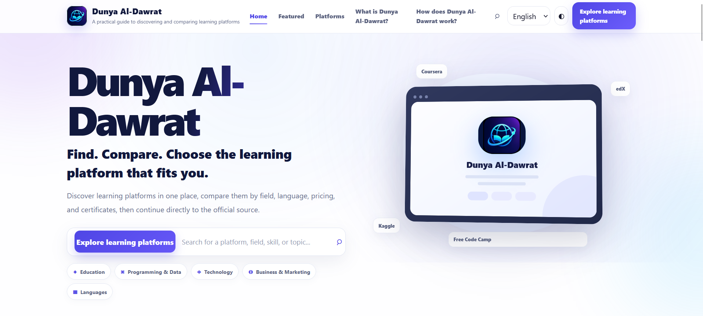

# Dunya Al-Dawrat — دنيا الدورات

A multilingual educational discovery platform that helps students explore and compare learning platforms in one organized place.
- **Repository:** [devmyskilla.github.io](https://github.com/aasimaltomi/devmyskilla.github.io)
- **Live site:** [Dunya Al-Dawrat](https://devmyskilla.vercel.app/)
- ## Preview



## Overview

Dunya Al-Dawrat is designed to make online learning easier to navigate. The platform brings together structured information about educational platforms so users can explore options based on factors such as field, language, pricing, and certificates.

The current public build includes **40 platform profiles** and a dedicated exploration experience.

## Highlights

- 🔎 Explore and search educational platforms
- 🌍 Multilingual interface
- 📱 Responsive, installable PWA experience
- 📴 Offline support through a service worker
- 📚 Individual platform pages
- 🧭 Structured navigation and discovery flows
- 🔍 SEO foundations including canonical URLs, Open Graph metadata, sitemap, and robots.txt

## Tech Stack

- **HTML5**
- **CSS3**
- **JavaScript**
- **JSON**
- **Progressive Web App (PWA)**
- **GitHub Pages**
- **Vercel**

## Project Structure

```text
.
├── index.html
├── explore.html
├── platform.html
├── course.html
├── css/
├── js/
├── assets/
├── data.json
├── research-data.json
├── manifest.webmanifest
├── sw.js
├── sitemap.xml
├── robots.txt
└── tests/
```

## Status

The platform is under active development. Current work focuses on improving the user experience, platform content, design consistency, and maintainability while keeping the public site stable.

## Purpose

The project combines my interests in **web development, educational technology, product development, and accessible learning**. My goal is to make it easier for students and young people to discover useful learning opportunities without having to search across many disconnected sources.

## Developer

**Aasim Mohammed Altomi**

## My Role

- Lead development
- Web development
- Product structure
- User experience
- Content organization
- Continuous improvement

- GitHub: [@aasimaltomi](https://github.com/aasimaltomi)
- LinkedIn: [aasimaltomi](https://www.linkedin.com/in/aasimaltomi/)

---

```md
## Feedback & Contributions

Suggestions, bug reports, and ideas are welcome through GitHub Issues.
